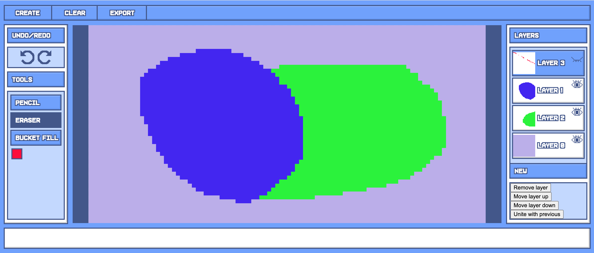
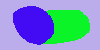

# Platform for creating and sharing pixelated animations  

The project is using modular JS on the frontend. For deployment, it will be assembled into a single file.
Moreover, there are unit-test created with the <b>Mocha</b> framework.

User interface is currently extremely raw. It will be improved in the future.

🟩 - implemented  
🟦 - implemented but needs optimizing  
🟨 - partially implemented  
🟥 - not implemented  
⬜️ - will be implemented only if I have enough time

<table style="empty-cells: hide">
    <th>
        Core features
    </th>
    <th>
        Firebase
    </th>
    <th>
        ⬜️ Additional features
    </th>
    <tr>
        <td>
            🟩 <a href="https://github.com/MytsV/pixel-toons-editor/blob/dev/public/scripts/core/canvas_renderer.js">Canvas rendering</a>
        </td>
        <td>
            🟥 Account creation/login
        </td>
        <td>
            More tools (line, ellipse, gradient)
        </td>
    </tr>
    <tr>
        <td>
            🟩 <a href="https://github.com/MytsV/pixel-toons-editor/blob/dev/public/scripts/core/tools.js">Basic tools (pencil, eraser, bucket fill)</a>
        </td>
        <td>
            🟥 Saving your animation to account
        </td>
        <td>
            🟩 Tool settings (thickness, tolerance)
        </td>
    </tr>
    <tr>
        <td>
            🟩 Undo/Redo system
        </td>
        <td>
            🟥 Retrieving other's animations
        </td>
        <td>
            Own color picker
        </td>
    </tr>
    <tr>
        <td>
            🟩 Layer system
        </td>
        <td>
            ⬜ Likes, comments
        </td>
        <td>
            More file export formats
        </td>
    </tr>
    <tr>
        <td>
            🟩 Zoom system
        </td>
        <td></td>
        <td>
            Editor sugar (flip, transform, navigation)
        </td>
    </tr>
    <tr>
        <td>
            🟩 BMP Encoder (lacking 32bit option)
        </td>
        <td>
        </td>
        <td>
            🟩 Opacity
        </td>
    </tr>
    <tr>
        <td>
            🟩 Key shortcuts
        </td>
        <td>
        </td>
        <td>
            Shortcut setting
        </td>
    </tr>
    <tr>
        <td>
            🟩 Canvas "file" system
        </td>
        <td>
        </td>
        <td>
            Pointer and coordinates
        </td>
    </tr>
    <tr>
        <td>
            🟩 Frames
        </td>
        <td>
        </td>
        <td>
            Layer names
        </td>
    </tr>
    <tr>
        <td>
            🟥 GIF encoder
        </td>
        <td>
        </td>
        <td>
        </td>
    </tr>
    <tr>
        <td>
            🟥 Own file format with specifications
        </td>
        <td>
        </td>
        <td>
        </td>
    </tr>
    <tr>
        <td>
            🟥 Set up one file assembling, babel, minifier for release
        </td>
        <td>
        </td>
        <td>
        </td>
    </tr>
</table>

Interface demonstration  
  
Exported image from demonstration  

