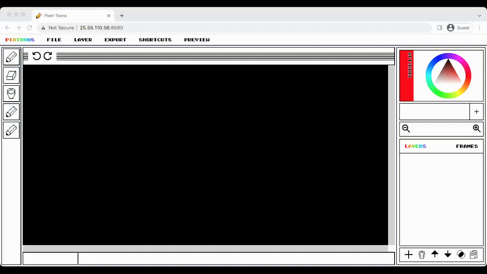

<!-- PROJECT LOGO -->
<br />
<div align="center">
    
    <br />
    <span style="font-size:8pt"><i>I was created in Pixel-Toons Editor, meow!</i></span>

<h2 align="center">🎨 Vivid pixel-art in your browser 🎨</h3>


  <p align="center">
    An open-source platform for creating and sharing pixelated animations. 
    <br />
    School project by <b>Victoria Myts</b> for 🎓KPI
    <br />
    <br />
    <a href="https://github.com/MytsV/pixel-toons-backend"><strong>⚙️ Explore the backend source code ⚙️</strong></a>
    <br />
    <br />
    <a href="#features">Features</a>
    ·
    <a href="#roadmap">Roadmap</a>
    ·
    <a href="https://github.com/MytsV/pixel-toons-editor/issues">Report Bug</a>
    <br />
  </p>
</div>

<div align="center">



</div>

<h2>🚀 Getting started</h2>

<i>Installation via GitHub:</i>

```bash
git clone https://github.com/MytsV/pixel-toons-editor
npm i --force
```

<i>Running the app:</i>

```bash
#Check and fix syntax via eslint
npm run check
#Run tests
npm run test
#Start the server
npm run start
```

<h2>🛠 Technologies</h2>

[](https://skills.thijs.gg)

* Modular JS on the frontend with <b>Web API</b>
* No external libraries used!
* <b>Babel</b> for deployment compilation
* Unit-tests with <b>Mocha</b>

<a name ="roadmap"></a>
<h2>🗺 Roadmap</h2>

| Future features        | Implemented |
|------------------------|-------------|
| ⚙️ Integration of backend service | 🎬 [ Frames ](#frames)           |
| 🚀 Assembly and deploy    | 🎨 [Canvas & Layers](#canvas)            |
|                        | 👩‍🎨 [Tools](#tools) |
| | 🌠 [BMP encoder](#bmp) |
| | 🍿 [LZW compression & GIF encoder](#gif) |
| | 👤 [Database handling & Authentication](#auth) |
| | 💾 [Own file format](#pxt) |

<a name ="features"></a>
<h2>✨ Features</h2>

<a name ="frames"></a>
<h3>Frames</h3>

> Implemented as a part of File class. Can have variable duration and order.

<a name="canvas"></a>
<h3>Canvas & Layers</h3>

> Caching, implementations of Prototype and Memento patterns and high encapsulation.

<a name="tools"></a>
<h3>Tools</h3>

> Convenient abstraction for easy creation of new tools

<a name="bmp"></a>
<h3>BMP encoder</h3>

> Implementation of open-source file format specification. See code comments for source.

<a name="gif"></a>
<h3>LZW compression & GIF encoder</h3>

> Implementation of LZW compression algorithm and popular file format. See code comments for source.

<a name="auth"></a>
<h3>Database handling & Authentication</h3>

> Almost the only part using asynchronous programming. Implemented with Firebase. The public key in the files is secure to be shared.
